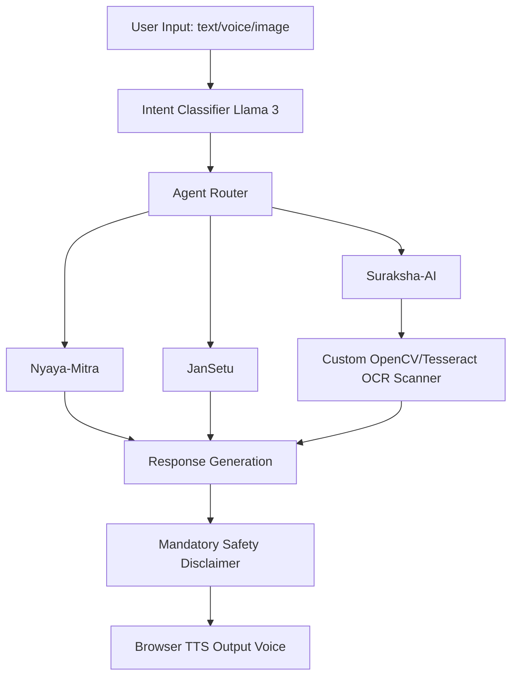

<div align="center">
  <h1>AI JanMitra — जन-मित्र</h1>
  <p><b>People's Friend — A free, multilingual AI assistant for every Indian citizen.</b></p>
</div>

## What is JanMitra?
Millions of Indians lose money to digital scams, miss welfare benefits they qualify for, and struggle to understand legal notices written in complex language. AI JanMitra bridges this gap — a unified AI platform offering legal guidance, government scheme discovery, and fraud detection, entirely free, in 8 Indian languages, with voice and image support.

## Features
### Three Intelligent Agents
| Agent | Purpose | Capabilities |
|-------|---------|-------------|
| ⚖️ Nyaya-Mitra | Legal guidance | BNS/BNSS/BSA explanations, RTI drafts, consumer rights, complaint templates |
| 🏛️ JanSetu | Scheme discovery | 500+ central & state schemes, eligibility matching, step-by-step application help |
| 🛡️ Suraksha-AI | Scam detection | Document OCR, WhatsApp scam analysis, fake notice detection, real-time advisory cross-check |

### Embedded Chatbot (Every Page)
- 💬 **Text chat** — Ask anything in any supported language
- 🎤 **Voice input** — Speak your question; auto-transcribed via Web Speech API
- 🔊 **Voice output** — AI reads responses aloud in your language
- 📷 **Image upload** — Photograph any notice/document for instant analysis
- 🌐 **8 languages** — Switch language mid-conversation

### Document Scanner
- OCR text extraction from photos, PDFs, screenshots
- Red flag detection with severity levels
- Fraud probability score (0–100%)
- Safe next-steps with official helpline numbers
- Cross-verified against RBI, cybercrime.gov.in, CERC

---

## Multilingual Support
| Language | Code | Voice Input | Voice Output |
|----------|------|-------------|--------------|
| हिंदी (Hindi) | hi-IN | ✅ | ✅ |
| தமிழ் (Tamil) | ta-IN | ✅ | ✅ |
| বাংলা (Bengali) | bn-IN | ✅ | ✅ |
| తెలుగు (Telugu) | te-IN | ✅ | ✅ |
| मराठी (Marathi) | mr-IN | ✅ | ✅ |
| ಕನ್ನಡ (Kannada) | kn-IN | ✅ | ✅ |
| ગુજરાતી (Gujarati) | gu-IN | ✅ | ✅ |
| English | en-IN | ✅ | ✅ |

*Voice input and native output works best in Google Chrome or Microsoft Edge for Indian language recognition.*

---

## Tech Stack
*100% free-tier infrastructure — zero cost to run at prototype scale.*

### Frontend
| Technology | Purpose | Platform |
|------------|---------|----------|
| React + Vite | UI framework | Vercel |
| DM Serif Display + DM Sans | Typography | Google Fonts |
| Web Speech API | Voice input/output | Browser-native |
| CSS Modules | Styling | Frontend |

### Backend
| Technology | Purpose | Free Tier |
|------------|---------|-----------|
| FastAPI (Python 3.10) | API orchestration | Render (750 hrs/month) |
| Llama 3 (OpenRouter) | Core LLM & Routing | Free Tier / API limits |
| Tesseract OCR + OpenCV | Document Extraction | Ubuntu API Node |
| BeautifulSoup | Real-time Search | Web Scraping (DuckDuckGo) |
| Supabase | Database / Auth Storage | 500MB DB |

---

## AI Pipeline


## Getting Started

### 1. Full Stack Setup
```bash
# Clone the repo
git clone https://github.com/your-org/ai-janmitra.git
cd ai-janmitra
```

### 2. Backend (FastAPI)
```bash
cd backend

# Create Virtual Environment
python -m venv venv
source venv/bin/activate  # (Windows: .\venv\Scripts\Activate.ps1)

# Install Requirements
pip install -r requirements.txt

# Run the server
uvicorn app.main:app --reload
```
*Note: Make sure you have Tesseract-OCR installed on your system if running on Windows.*

### 3. Frontend (React + Vite)
```bash
# Open a new terminal
cd ai-janmitra
npm install
npm run dev
```

### 4. Deploy
```bash
# Push to GitHub
git remote add origin https://github.com/YourUsername/ai-janmitra.git
git push origin master
```
- **Backend**: Connect GitHub to Render. Select Python Environment. Use `build.sh` for the Build Command and `render.yaml` configurations.
- **Frontend**: Connect GitHub to Vercel. Select Vite Framework. 

---

## Safety & Disclaimers
1. Every AI response includes a mandatory disclaimer: "यह पहली-कदम मार्गदर्शन है, कानूनी सलाह नहीं।"
2. Uploaded documents are converted to matrices in-memory and are deleted immediately after OCR analysis.
3. JanMitra is a first-step guidance tool — not a substitute for professional legal advice.

---

## License
MIT License — free to use, modify, and distribute. By Sayan Roy Chowdhury.
